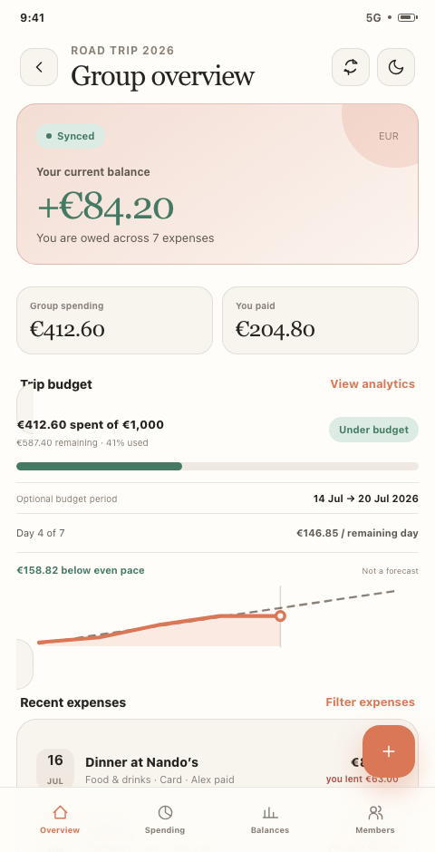
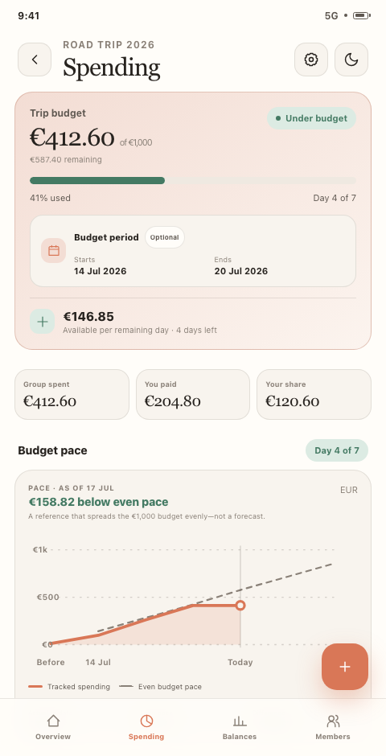
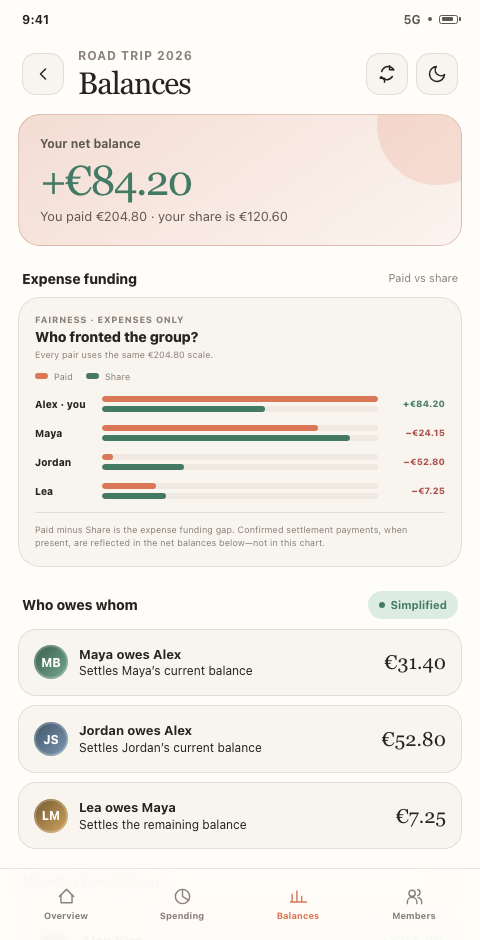
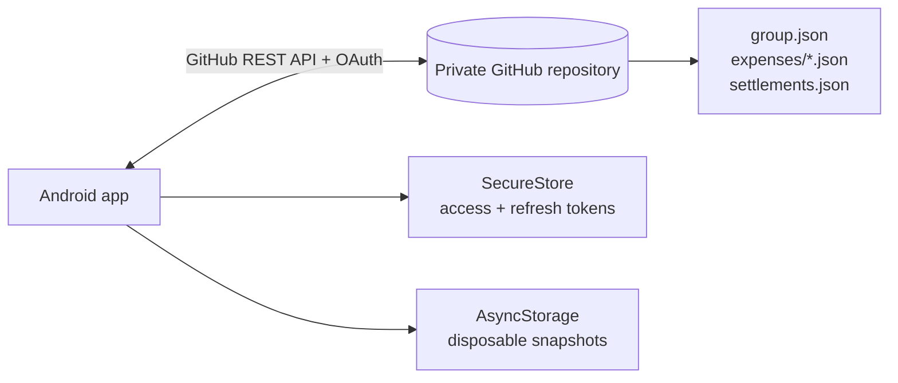

<p align="center">
  
</p>

<h1 align="center">BranchBalance</h1>

<p align="center"><strong>Split expenses. See the whole picture. Keep control of your data.</strong></p>

<p align="center">
  A privacy-first Android expense-sharing app backed by private GitHub repositories.<br>
  No BranchBalance server, no opaque database, and no mystery export process.
</p>

<p align="center">
  <a href="https://github.com/BrunoV21/BranchBalance/releases/latest"></a>
  <a href="https://github.com/BrunoV21/BranchBalance/actions/workflows/ci.yml"></a>
  <a href="https://github.com/BrunoV21/BranchBalance/actions/workflows/docs.yml"></a>
  <a href="https://github.com/BrunoV21/BranchBalance/releases/latest"></a>
  <a href="https://docs.expo.dev/"></a>
  <a href="LICENSE"></a>
</p>

<p align="center">
  <a href="https://github.com/BrunoV21/BranchBalance/releases/latest"><strong>Download the Android APK</strong></a>
  ·
  <a href="https://brunov21.github.io/BranchBalance/">Product &amp; docs</a>
  ·
  <a href="mockups/">Interactive mockups</a>
</p>

## ✨ Why BranchBalance?

- **Your group owns the data.** Every group is a private GitHub repository containing readable JSON and its Git history.
- **There is no app backend.** The Android app talks directly to GitHub for identity, membership, storage, and sharing.
- **The maths is exact.** Amounts use integer minor units, shares are deterministic, and settlement suggestions are calculated on-device.
- **It goes beyond “who owes whom.”** Track budgets, category limits, spending pace, payment methods, funding fairness, and confirmed settlements.
- **Concurrent changes are explicit.** Expense and settlement writes use GitHub blob SHAs so a stale device cannot silently overwrite newer data.

## 📱 Product tour

<table>
  <tr>
    <th align="center">Group overview</th>
    <th align="center">Spending intelligence</th>
    <th align="center">Balances &amp; fairness</th>
  </tr>
  <tr>
    <td></td>
    <td></td>
    <td></td>
  </tr>
</table>

> These screens are rendered from the repository's [interactive HTML mockups](mockups/), which cover all 12 primary product flows in light and dark themes.

## 🧭 How it works

1. **Connect GitHub** through the GitHub App device flow. Rotating credentials stay in secure storage on the phone.
2. **Create a group.** BranchBalance creates a private `branch-balance-<slug>` repository under your personal account.
3. **Invite collaborators.** GitHub's collaborator list remains the source of truth for group membership.
4. **Track and settle.** Members add expenses, understand spending, and record payments completed outside the app.

BranchBalance records transfers; it does **not** move money or connect to financial accounts.

## 🧰 Feature set

| Area | Included in v1.1 |
|---|---|
| 🔑 Authentication | GitHub App device flow, expiring tokens, atomic refresh-token rotation, secure sign-out |
| 👥 Groups | Private repository creation, discovery, collaborator invitations, accepted and pending members |
| 🧾 Expenses | Add, edit, and delete; equal, full-to-one, and Just me splits; categories and payment methods |
| 📊 Spending | Group and category budgets, optional trip dates, daily guidance, pace and mix analytics, combined filters |
| ⚖️ Balances | Exact per-member balances, simplified debts, paid-versus-share analysis, pending and confirmed settlements |
| 🔔 Activity | Foreground-only, on-device inbox for newly observed group changes |
| 🔄 Sync | Refresh on focus, foreground, and pull-to-refresh; cached snapshots remain visible on transient failures |
| 🌓 Experience | System, light, and dark themes; accessible labels, text summaries, and touch targets |

## 🏗 Architecture



GitHub is authoritative. Local storage is limited to credentials and a stale-while-revalidate cache; BranchBalance never presents a cached write as remotely committed.

The app is built with Expo SDK 57, React Native, TypeScript, Expo Router, Octokit, Zod, SecureStore, and AsyncStorage. See the [architecture guide](docs/ARCHITECTURE.md) for dependency boundaries, schemas, and concurrency decisions.

## 🚀 Getting started

### Install the Android release

Download the signed APK and its SHA-256 checksum from the [latest GitHub release](https://github.com/BrunoV21/BranchBalance/releases/latest). Android is the supported runtime; iOS is not currently a release target.

### Run from source

Requirements:

- Node.js 20 or newer
- npm 10 or newer
- Expo Go on an Android device, or an Android emulator
- A GitHub App configured for BranchBalance

```sh
git clone https://github.com/BrunoV21/BranchBalance.git
cd BranchBalance
npm ci
cp .env.example .env
```

Create a GitHub App under **GitHub Settings → Developer settings → GitHub Apps**, then:

1. Enable **Device Flow**.
2. Grant repository **Contents** and **Administration** read/write permissions.
3. Keep expiring user authorization tokens enabled.
4. Allow the installation to cover all repositories so newly created groups are accessible.
5. Set `EXPO_PUBLIC_GITHUB_CLIENT_ID` and `EXPO_PUBLIC_GITHUB_APP_SLUG` in `.env`.

The client ID and slug are public metadata. Never add a GitHub client secret to the app. The [GitHub App setup guide](docs/official/getting-started/github-app.md) explains the installation and authorization flow.

Start Expo:

```sh
npm start
```

For an Android device or emulator on the same network:

```sh
npm run android
```

### Android device over USB

If Expo Go reports `java.io.IOException: Failed to download remote update`, treat it as a device-to-Metro connection problem first. With USB debugging enabled:

```sh
adb devices
adb reverse tcp:8081 tcp:8081
npx expo start --localhost --android
```

Recreate the reverse mapping after reconnecting the cable or device. API errors that appear after the JavaScript bundle loads are separate application-level failures.

## 🧪 Development and validation

```sh
npm run validate
```

The full validation command runs TypeScript, ESLint, the Jest suite, and Expo Doctor. Individual commands are also available:

```sh
npm run typecheck
npm run lint
npm test -- --runInBand
npm run doctor
```

Tests cover domain money rules, schemas, GitHub/OAuth transport, storage, providers, reconciliation, and screen behaviour. See the [testing guide](docs/TESTING.md) for automated and physical-device acceptance.

## 📦 Build a release APK locally

```sh
npm ci
CI=1 npx expo prebuild --platform android --no-install
node scripts/configure-android-release-signing.mjs
(cd android && NODE_ENV=production ./gradlew :app:assembleRelease)
```

The signing configurator reads `ANDROID_KEYSTORE_PATH`, `ANDROID_KEYSTORE_PASSWORD`, `ANDROID_KEY_ALIAS`, and `ANDROID_KEY_PASSWORD`. The APK is written to `android/app/build/outputs/apk/release/app-release.apk`. Local release builds require the Android SDK, NDK, and Java 17.

Tagged versions are validated, signed, checksummed, and staged through GitHub Actions. Read the [release process](docs/official/releases/releasing.md) before creating a version tag.

## 🔐 Data ownership and security

Each group repository has a deliberately small structure:

```text
branch-balance-road-trip/
├── group.json
├── settlements.json       # created with the first recorded payment
└── expenses/
    ├── <uuid>.json
    └── <uuid>.json
```

- Group, expense, plan, and settlement data lives in the private repository.
- GitHub collaborators with repository access can read that shared data.
- Access and refresh tokens live in `expo-secure-store`.
- Non-secret local snapshots are disposable; GitHub remains the source of truth.
- Settlement notes are redacted from persistent device caches, but remain visible to repository members and may remain in Git history.
- Private GitHub repositories are access-controlled by GitHub; BranchBalance does not add end-to-end encryption.

Read [how data ownership works](docs/official/documentation/data-ownership.md), the [permissions model](docs/official/documentation/permissions.md), and the [credential security guide](docs/official/documentation/security.md).

## 🗺 Project docs

| Resource | What it covers |
|---|---|
| [Product website & documentation](https://brunov21.github.io/BranchBalance/) | Published guides, data ownership, releases, and product overview |
| [Product requirements](docs/PRD.md) | Implemented scope, product decisions, and acceptance criteria |
| [Architecture](docs/ARCHITECTURE.md) | System boundaries, models, sync, security, and UI decisions |
| [Testing](docs/TESTING.md) | Automated validation and physical-device scenarios |
| [Roadmap](ROADMAP.md) | Known limitations and possible future work |
| [Interactive mockups](mockups/) | Twelve responsive screens plus the original website prototype |

Current boundaries include Android-only releases, always-online writes, foreground refresh rather than push notifications, and a GitHub App limitation that can hide pending private-repository invitations before acceptance. Receipt images, percentage splits, currency conversion, and organization-owned groups are not yet included.

## 🤝 Contributing

Issues and pull requests are welcome. Please run `npm run validate` before submitting code and keep product behaviour aligned with the PRD and architecture guide.

## License

BranchBalance is open-source software available under the [MIT License](LICENSE).
